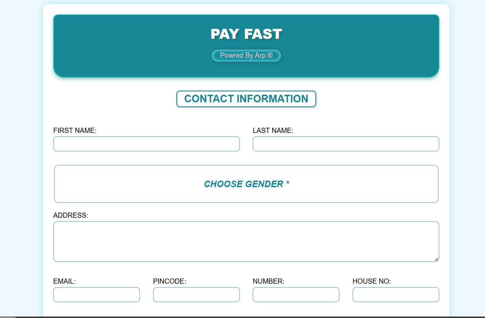

# 💳 Payment Form Project

A simple, visually appealing, and interactive payment form created using HTML, CSS, JavaScript, and Firebase. This project demonstrates fundamental web development techniques to build a clean and modern user interface for a payment gateway, complete with a multi-step flow, dynamic animations, and database integration.

## 📸 Screenshot



## ✨ Features

*   **Clean & Modern UI:** A stylish, structured, and user-friendly interface for a smooth experience.
*   **Multi-Step Payment Flow:** Seamlessly transitions between data entry, authentication/verification, amount entry, and success screens.
*   **Dynamic Animations:** Engaging hover effects, interactive form sections, loader animations, and dynamic SVG lock morphing.
*   **Interactive Form Validation:** Client-side requirements with visual cues.
*   **Firebase Integration:** Securely saves form submission data to a Firestore database.
*   **Custom Styled Header:** A visually distinct top section with elegant typography and layout.

## 🛠️ Technologies Used

*   **HTML5:** For the robust structure and content of the multi-step form.
*   **CSS3:** For all the styling, custom animations, responsive layouts, colors, shadows, and borders.
*   **JavaScript (ES6):** For DOM manipulation, handling the multi-step logic, and triggering animations.
*   **Firebase (Firestore):** For robust backend database storage.

## 🚀 How to Use

1.  **Clone the repository:**
    ```bash
    git clone https://github.com/your-username/payment-form.git
    ```
2.  **Navigate to the project directory:**
    ```bash
    cd payment-form
    ```
3.  **Set up Firebase:**
    *   Rename `firebase_config.js.example` to `firebase_config.js`.
    *   Open the new `firebase_config.js` file and replace the placeholder values with your actual Firebase project configuration.

4.  **Open the application:**
    *   Start a local server (e.g., using Live Server in VS Code) or open `index.html` directly in your favorite web browser.

## 🤝 Contributing

Contributions, issues, and feature requests are welcome!

--_(●'◡'●)_--